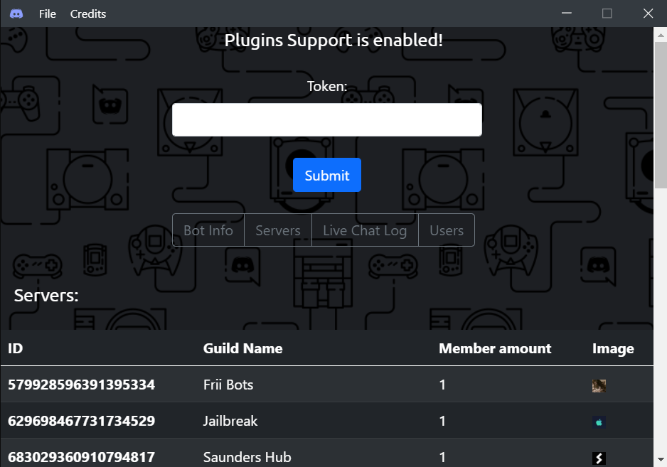

# BotCheck

 
 
Checks a discord bot's token info using JS

## Current Status:

### Build Status (Nightly):
*(You can Download Nightly build by clicking on the badge)*

## Plugin Support

Plugin support is currently in early stages tho there is currently already some stuff possible :), such as theming (as seen in the screenshot) 
All the plugins are available at [here](https://github.com/DwifteJB/BotCheck/tree/plugins)
